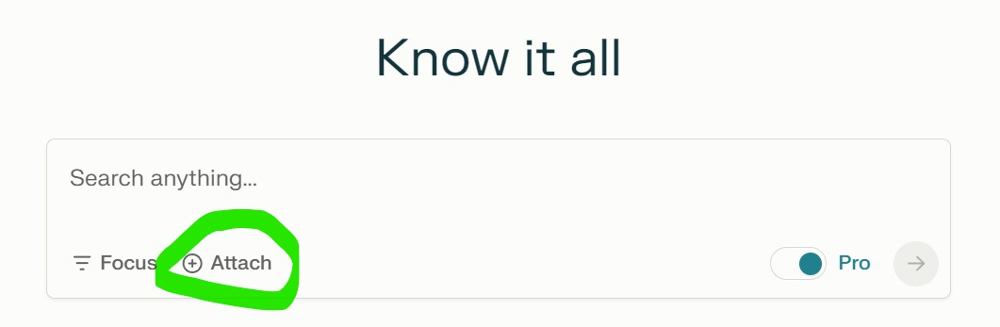

# Instructions
1) The [AIPrompter.py](AIPrompter.py) should be in its own directory.
2) Run the program to compile your website into a single text file, you'll have a few different options:

   Run program with the path to your local directory of your entire website and give it the desired file name of your output text file. 
   ```
   python AIPrompter.py /path/to/website/directory --output custom_output_file.txt
   ```

   Run the program to only compile the HTML and CSS (ignoring .js files)
   ```
    python AIPrompter.py /path/to/website/directory --html-css
   ```

   Your text file of all the code of your website (including a table of contents of all the nested location of files) is ready to use for prompting.
   Upload the file to your favorite AI, and start talking with it about your website.
   

   I like to start like this
   ```
   I've just uploaded myEntireWebsiteCode.txt, it contains the entire code for my website.
   Please confirm that you have studied it thouroughly,
   and I will have follow-up technical questions about the html and CSS styling starting with the index.html file,
   specifically the <div class='whatever'> element.
   Please confirm so we can begin.
   ```
