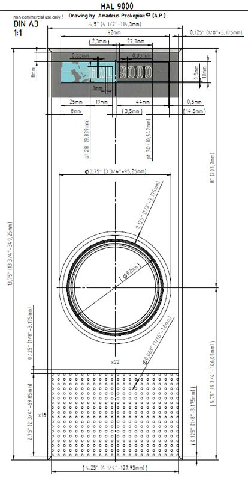

# AI Prompter
My front-end AI prompting solution and code can be found [here](README-TECH.md), but first a few words on AI

## AI Expertise vs “Prompt Engineering” & other observations on the un-folding AI situation
Like anyone else who has had the interesting privilege to be alive in the past year and a half, I have lots of thoughts, memories, questions, and opinions on the ongoing AI situation. \
After recently listening to a podcast of MIT students promoting their new AI powered IDE, I realized that, even among the brightest and most talented people working under in the field of AI, there are very precious few people who understand how this all works under the hood. \
The MIT engineering and computer science students had created an AI powered IDE, Great! \
They have more information and knowledge of the subject than most, and yet behind the curtain of their new IDE, it was only prompting LLMs with a backend API of something like CHATGPT. \
To my surprise, I could not really detect that the creators of the IDE had any expertise on how this was working under the hood, but rather are trying to fulfill a market niche with the same User Interface as the rest of us i.e. ‘AI prompting’ or what is maybe embellished as “prompt-engineering”

I dont have an entire IDE to share with you here, but considering that a group of MIT students are spending their time marketing promp-engineering solutions, \
I thought I would share my own prompt solution I personnally use. \
Skip straight to the Technical Readme file [here](README-TECH.md), to start prompting your AI to help you design webpages.

I want to share a number of general AI observations:
1) There are going to be a certain percentage people who try to understand and use this technology and another portion of people who will be left behind.  I would recomend everyone try to use AI in order to be productive and competetive in the market place and in their personal lives.  Moreoever, these technologies should not be feared in education.  Students should be taught and familiarized with AI now.
2) AI has changed the art and science of coding.  From now on, it will be very beneficial to have a high-level understanding of programing.  Everyone (especially in the Tech space) should know the basics of programing: how functions work, exposing your code to outside libraries, passing variables to a function, etc. \
and the technical vocabulry to describe what is going on in a segment of code. \
The benefit of AI might be that we will not have to do the most tedious, mindnumbing, and time consuming aspects of coding, and that is absolutly amazing, but AI is not going to do everything for us. 
We will have to have a high-level understanding and descriptive vocabulary in order to technically and accuratly communicate with AI tools to get our desired solutions.  

4) There are precious few people how understand this technology under the hood. \
   After listening to this long-form interview with MIT students marketing a fancy AI prompter, I realized that even at the worlds greatest engineering university, there must only be a small handful of individuals who know what is happening under the hood i.e. what is the 'compute' behind the prompting. \
I am the son of a very talented electrical-engineer in the automotive space.  My father has a deep understanding of physics as well. \
I can share from a first-princial point of view, that the tiny number of people who are natual-born engineering talents and who scrible physics equasions on napkins; they are likely not good at self-promoting, marketing, or even basic inter-personal communication .  I'm sure there are exceptions to this rule, but thats the general rule.  These talents that have spent their time and effort and have made personal sacrifices working to bring this technology to the masses will not be in the history books, and will be very hard to identify and find in the market place.

5) No-one knows where this is going.  In a decade or two, or less.  We will likly have radically new and effective medicines and more customized health solutions, discoveries in material sciences, engineering, compute power, etc. \
OR this might be the first step towards a [Skynet situation](https://en.wikipedia.org/wiki/Skynet_(Terminator)) or [The Butlerian Jihad](https://en.wikipedia.org/wiki/Dune_(franchise)#The_Butlerian_Jihad).  What an incredible contrast of outcomes.

Please feel free to email me on any of these topics. 

Let's tune back into my AI prompting solution:
This is a simple command-line program in Python that I run locally when working on a static webpage. 

INPUT : the local directory of your website. \
COMPUTE : it finds all .HTML, .CSS, and .JS files nested in all their respective directories. \
OUTPUT : you receive single text file (ready to upload to your favorite LLM) with the entire code and table of contents at the top.

The Result: your AI assistant very quickly gets the complete understanding of your website before you start asking it technical questions. 

## Why it’s great for prompting
If your anything like me, and you don’t enjoy the tedious process of fine-tuning a website: adjusting CSS media rules, getting different elements to sit in their own containing elements, maintaining a uniform aesthetic between different pages in the website, etc.\
You have probably utilized an LLM to help you adjust or create new elements in your website.  The challenge inevitably arises that your LLM does not have a comprehensive or high-level understanding of the website that you’re working on.  As time goes on, your LLM even forgets what you thought you were talking about. 

If you’re here on GitHub perusing code, you know that static webpages are divided into different files.  All of the pages in your website have their own HTML files, one or more CSS style sheets, and the same for any frontend JavaScript complications.  

Ideally you want your LLM to know all of the code in each of these files and how each of the files work together, and you’ll want to update the LLM on each major change, and you’ll have a nice laser-focused work flow. \
Rather than manually getting all of this code and pasting it on text file and uploading it to your LLM give this a try so that you, your website, and your AI assistant are all on the same page! 

Try it [here](README-TECH.md)
