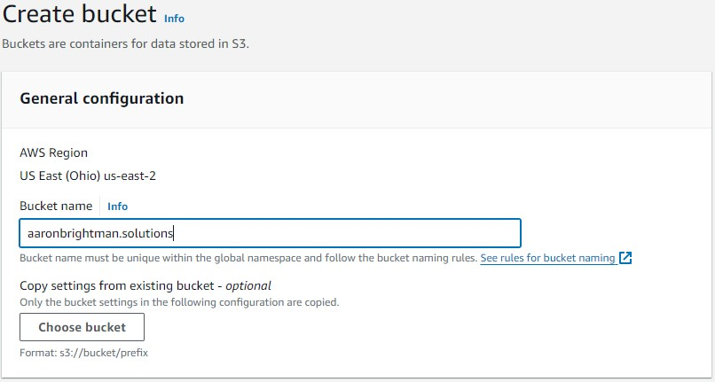
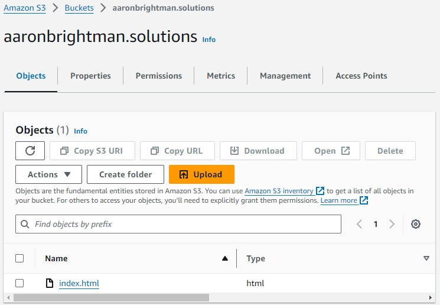
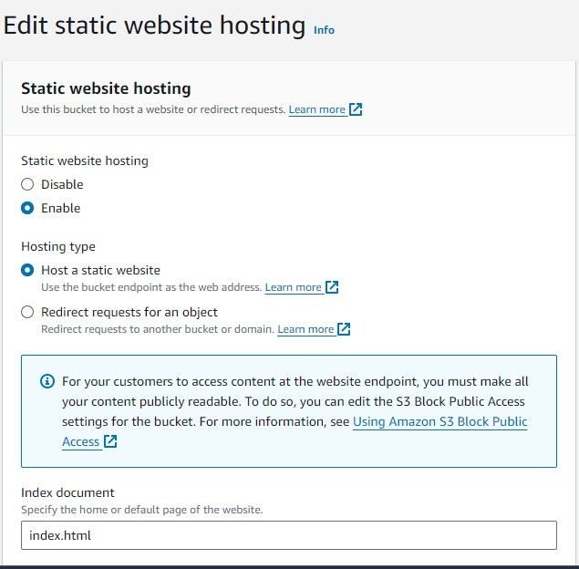
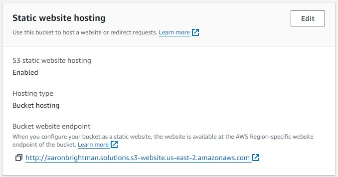

# My Own Static S3 Website

\
[Located here](https://www.aaronbrightman.com)


This is a little tutorial to create a static website hosted on the AWS Cloud.  Maybe you have a website of your own, or several.


Using an S3 bucket to host a website is not re-inventing the wheel.  Besides the having your files operate with native compatibility of the many AWS services, I want to highlight few benefits over more popular hosting solutions:

1) **Cost vs Performance** - I am only paying for the S3 storage that I am using, it’s a few cents a month and in conjunction with CloudFront (AWS's CDN service) my website is Cached Globally and can be downloaded at any of the 600 'Points-of-Presence' edge locations.  Wherever you are located, from Detroit to Manilla, to Buenos Aires, note how fast this website loads!

2) **Durability & Availability** - [According to](https://docs.aws.amazon.com/AmazonS3/latest/userguide/DataDurability.html) corporate literature and services agreements.  You get the “eleven-nines” of data durability: 99.999999999% of your 'objects' (i.e. Files) are guaranteed to persist without corruption: If you had 10 million files hosted, you can expect to lose a file every 10,000 years, while your availability is guaranteed 99.99%, or 53 minutes downtime a year.

4) **Granular Security** - S3 Resource policies allow you to granulate the permissions of your entire S3 bucket, entire folders, or each individual file.  Once you get the hang of how resource policies work, they are very straightforward and default to a very secure white-list model where your resources are created with no permissions (or no access).  You have to manually configure to expose your resources in order for users or services like CloudFront to use them.

This is not an extensive list, I could go on, let's get into it!

## Get your Files into an S3 Bucket
In the AWS Web-console, navigate to the S3 Service and find the big yellow create a bucket button.  Although S3 is a regional-service, they must have a unique name to the entire AWS cloud.

\
In this stage make sure the "Block all public access" is unchecked.

\
add your index.html file.
\

\
Congradulations, as you know you are already hosting your resoucres in the cloud, but we need to configure the bucket policy to expose your bucket with permissions to allow your content to be accessible from outside of your AWS account. \
You can easily find your bucket policy configurations in bucket's Permissions tab. \
It will be empty, becuase the bucket is created without any permissions. \
I have given it a very permissive policy to get to the result of seeing your index.html file publically hosted. \
Here is the polciy which allows: anyone to GetObjects from this bucket.
```json
{
    "Version": "2012-10-17",
    "Statement": [
        {
            "Effect": "Allow",
            "Principal": "*",
            "Action": "s3:GetObject",
            "Resource": "arn:aws:s3:::publicwebsitedemo1/*"
        }
    ]
}
```


\
To create your URL endpoint.  Navigate to the Properties tab of your bucket and edit & enable Static Website Hosting.
\


\
After saving this configuration, out comes your public URL.

\
Have a look!
\
[http://publicwebsitedemo1.s3-website.us-east-2.amazonaws.com/](http://publicwebsitedemo1.s3-website.us-east-2.amazonaws.com/)
\
## Your S3-Website + (Route53 + ACM + CloudFront)

We have a publicly available site, it functions fine, but as it stands:
a) it is not using an SSL certified https protocol - so all data between your bucket and the client is being sent in unencrypted plain-text.  Maybe not the biggest of deals for your static website, but in modern browsers there is a warning displayed that is unsettling  for the client to view.
b) you do not have your custom URL, but this ugly bucket address.
\
Let's address these two issues by:
1) Buying/Registering a custom domain in Route53, and creating a Hosted Zone for our DNS records.
2) Applying for an SSL certificate from Amazon Certificate Manager.
3) Creating a CloudFront distribution, a CDN, which will sit between our Client and the S3 bucket. (This step is necessary because AWS will not allow you to use your SSL Certificate and DNS Records directly with the S3 bucket, which is an engineered restriction. \
However, the benefits of the CDN distribution are incredibly consistent performance and scalability.
Let's get into it!
