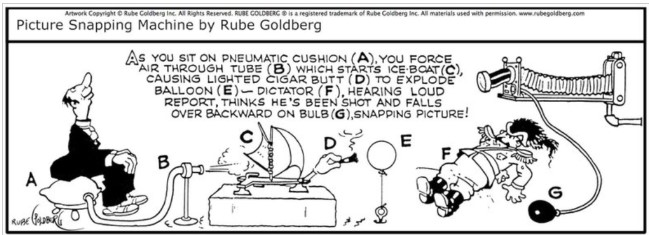
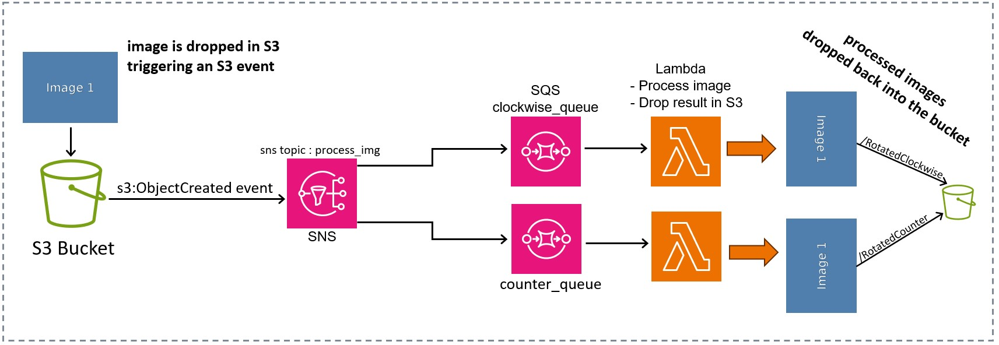

# The Rube Goldberg Image Machine
This is an exploration and documentation of an Event-Driven and auto-scalling Architecture on the AWS Cloud.  (And 100% Serverless)
\
Before exploring the Architecture, a quick summary of what goes on here:
1) An Image is dropped into an S3 Bucket.
2) two processed images are returned; one rotated 90 degrees Clockwise, and the other 90 degrees Counter-Clockwise \
Whats the big deal?      Well . . .

We do not have to provision a server, so we are only using (and paying for) the compute as it's needed.

and 

This is scalable - one can certainly create this operation with a tiny program runing on a computer from 1999.  but how would it handle 2 Million requests in a five minute period?

The roation of the image process could be replaced with whatever process you want, it is fault-tolerent and scalable architecture that is impressive.

Lets get into the architecture.
# Overview

The oldest AWS service, The S3 Bucket, is infinatly explanding object storage.  It also has a powerful events feature. \
Events can be configured for any action on an object (created, deleted, manipulated, etc.)
\
When these events happen, the bucket can send an events message (with metadata about the file attached) to three different targets: a Lambda Function, an SQS Queue, or an SNS Topic as we will be doing here.   

#### SNS/SQS Fan-Out
Rather than send our S3 event message directly to the function to start processing the images, we have implemented a "SNS/SQS Fanout" Architecture.
This well documented configuration allows for:
1) **Decoupled modularity** - we can easily expland the funcionality by adding more subscribers to the SNS queue to do whatever we want without any interuption or need to change the existing code or other configurations.
2) **Fault Tolerance** - Lets say there is no SNS/SQS handeling mechanism, and we designed the S3 event to directly trigger the lambda functions.
 \
 It would work fine until we have a massive burst of traffic e.g. more than a 1000 images are dropped into the bucket per second. In a few mintues or less, this would crash.
\
 Yes, our lambda functions can scale out to a maximum of 1000 Concurrent functions, but that would not be enough.
\
 With the SQS handling and pushing the messages to our Lambdas functions, we have a very fault-tolerant approach which is garuenteeing delivery and receiving messages. Each lambda instance confirms that compute process is successful for each and every event on the SQS.
