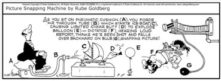
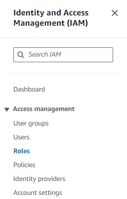

# The Rube Goldberg Image Machine
This is an exploration and documentation of an Event-Driven and auto-scalling Architecture on the AWS Cloud.  (And 100% Serverless)
\
Before exploring the Architecture, a quick summary of what goes on here:
1) An Image is dropped into an S3 Bucket.
2) Two processed images are returned: one rotated 90 degrees Clockwise, and the other 90 degrees Counter-Clockwise \
Whats the big deal?      Well . . .

We do not have to provision a server, so we are only using (and paying for) the compute as it's needed.

and 

This is scalable - one can certainly create this operation with a tiny program runing on a computer from 1995,  but how would it handle 2 million requests in a five-minute period?

The roation of the image process could be replaced with whatever process you want, it is the fault-tolerent and scalable architecture that is impressive.

Lets get into the architecture.
# Overview

The oldest AWS service, The S3 Bucket, is infinatly explanding object storage.  It also has a powerful events feature. \
Events can be configured for any action on an object (created, deleted, manipulated, etc.)
\
When these events happen, the bucket can send an events message (with metadata about the file attached) to three different targets: a Lambda Function, an SQS Queue, or an SNS Topic as we will be doing here.   

#### SNS/SQS Fan-Out
Rather than send our S3 event message directly to the function to start processing the images, we have implemented a "SNS/SQS Fanout" Architecture.
This well documented configuration allows for:
1) **Decoupled modularity** - we can easily expland the funcionality by adding more subscribers to the SNS queue to do whatever we want without any interuption or need to change the existing code or other configurations.
2) **Fault Tolerance** - Lets say there is no SNS/SQS handeling mechanism, and we designed the S3 event to directly trigger the lambda functions.
 \
 It would work fine until we have a massive burst of traffic e.g. more than a 1000 images are dropped into the bucket per second. In a few mintues or less, this would crash.
\
 Yes, our lambda functions can scale out to a maximum of 1000 Concurrent functions, but that would not be enough.
\
 With the SQS handling and pushing the messages to our Lambdas functions, we have a very fault-tolerant approach which is garuenteeing delivery and receiving of messages. Each lambda instance confirms that compute process is successful for each and every event on the SQS.

## Deployment (from the AWS console)
Let’s begin by setting up the bucket, followed by the Lambdas, SQS, and then finally SNS.
\
Find the S3 service and create a bucket.
\

\

\

\
(buckets have to have a lowercase name unique to all others on the AWS cloud) 
\
**note, to have a clean-look in the diagram there are two buckets for input and output. 
\
the concept is essentially the same, but we will be doing this whole process with one bucket separated into folders.
\
\
Let's put the bucket down and sort out our Lambda Functions. \
Now, our Lambda Functions will need to interact directly with three other services: our S3 Bucket, the SQS Queue, and Cloudwatch for logging. Let's create an IAM Role that has full permissions for these three services in order to quickly get this architecture running.
\
Ofcourse in a production settting, you would want to go back granulate the security policy to least amount of privledges neccissary to function. 
\
Open the IAM service and create a 'Role' \  We will set the permissions to the role, and later when we have our Lambda, we will give this role to it. 
\


\
Entity Type : AWS Service \
Use Case    : Lambda \
\
Now find and add the permissions to the role, it looks like this: \

\

\

\
name this role something like: "ImageMachine_Lambda_Role"
\
With the role created, and these three permissions attached to it, we can now set up the lambda. \
We will assign this role to the lambda, thereby giving it all of these permissions. (hopfully this is clear)

## Lambda Deployment
Find 'Lambda' in the AWS console, and go straight to the 'Layers' section  ==> 'Create Layer' \
 \
 \
  \
This is a prepackaged 'Layer' that contains the Pillow Library methods for Python, these popular Python methods are used for image manipulation.  Both of our Lambda Functions will use this library/layer.  You can see that the Layer is packaged as a zip file.  It was made on my local machine with Python's vitulization tool 'venv' to work perfectly with the Lambda runtime.  You can miss all of that, and upload the layer directly from my S3 bucket, copy and paste.
```
https://therubegoldberg.s3.us-east-2.amazonaws.com/Pillow-Layer.zip
```
Our layer set up, and we are already in the Lambda service. \
Find 'Functions' =and=> Create Function  \
Name your function, choose the Python 3.10 library (I used the older Python 3.10 environment becuase AWS is still having compatibility issues with later versions)
\
Assign it the 'ImageMachine_Lambda_Role' which is the IAM Role that we had just created.
 \
 \
 \
 \
With the Lambda created we can now quickly attach the new Pillow-Layer to the function and insert the code. \
You can find a diagram of your Lambda on the screen and click the Layer area, find the new Pillow-Layer and your set \


Here is the code. \
**Notice that there are three conspicous variables at the top of the function. \
make sure that the 'BucketName' variable - is the exact name of your bucket. \
When creating the second Lambda, the counterclockwise lambda function, the variable 'FolderName' should be changed and the 'Angle' variable should be an integer of -270 \


```python
import json
import boto3
from PIL import Image
import io

BucketName = 'therubegoldberg'
FolderName = 'TwistedClockWise'
Angle = -90
#set Angle variable to: 
# -90 for a Clockwise Rotation
# -270 for Counter-Clockwise Rotation 


s3 = boto3.client('s3')

def lambda_handler(event, context):
    for record in event['Records']:
        # Parse nested event structure
        s3_event = json.loads(json.loads(record['body'])['Message'])['Records'][0]
        
        # Extract S3 details
        bucket = s3_event['s3']['bucket']['name']
        key = s3_event['s3']['object']['key']
        
        if not key.lower().endswith('.gif'):
            continue  # Skip non-GIF files
        
        # Get and rotate image
        image_data = s3.get_object(Bucket=bucket, Key=key)['Body'].read()
        image = Image.open(io.BytesIO(image_data))
        rotated_image = image.rotate(Angle, expand=True)
        
        # Save and upload rotated image
        buffer = io.BytesIO()
        rotated_image.save(buffer, format='GIF')
        buffer.seek(0)
        
        new_key = f"{FolderName}/{key.split('/')[-1].replace('.gif', 'TwistedClockWise.gif')}"
        s3.put_object(Bucket = BucketName, Key=new_key, Body=buffer)

    return {'statusCode': 200, 'body': json.dumps('Processing complete')}
```
**Notice that nothing is saved and nothing will work until you hit 'Deploy' \
You should have two functions now, the 'RotateImageClockwise' function that we just made together, and the 'RotateCounterClock' that you figured out how to do using the same steps. \
Our Lambdas are up. . .  Even if you have one Lambda up and you made it this far, the rest is a very quick and easy.
\
Let's finish this, starting with the SQS Queue, Followed by the SNS Topic, and finnaly the S3 event (all takes two seconds)

## SQS/SNS Fanout Deployment
